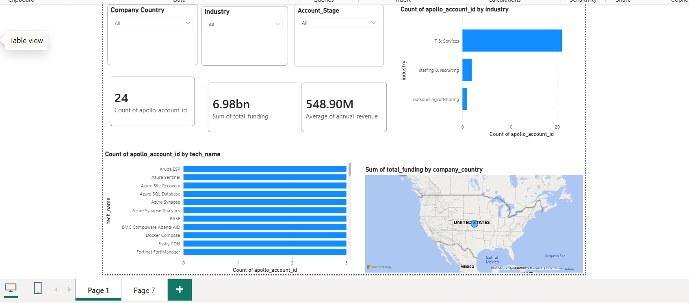

# B2B Lead Intelligence & Account Analytics Dashboard
An end-to-end data analytics project extracting B2B account data from Apollo.io, processing and cleaning attributes with Python, staging structured tables in MySQL Workbench, and visualizing pipeline metrics in Power BI.

---

## Dashboard Preview

---

## Tech Stack & Workflow
* **Data Source:** Apollo.io (Raw account extraction)
* **Data Processing:** Python (`pandas`) – Handling missing values and formatting fields
* **Database & Staging:** MySQL Workbench – Relational schema creation and analytical SQL querying
* **Visualization & Modeling:** Power BI – Custom ODBC connection, dynamic slicers, KPI summary cards, and regional maps

---

## Repository Structure
* `/scripts/data_cleaning.py` : Python script used to clean raw extract data.
* `/scripts/schema_and_queries.sql` : SQL scripts for database setup, table creation, and analytical queries.
* `/pbix/B2B_Lead_Analytics.pbix` : Complete Power BI report file.

---

## Key Business Insights
* Evaluated **$6.98B** in total target company funding across **24** key accounts.
* Identified heavy market concentration in **IT & Services**.
* Mapped software adoption trends (Azure, Docker, Fastly) to enable targeted sales outreach strategies.
